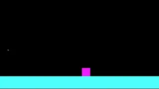

# Wormgine 2
I felt like making an ECS-based game engine. The initial product took maybe a day, so it's not featureful, useful, or anything like that. I'll probably chip away at it when I don't have better things to do.

It's called Wormgine because my primary intention is to create slithery worms/snakes.

`include/topdown-controller.hpp` is the very messy class I've been using to see how things are going. It currently has a platformer (not top-down) character and a bunch of rectangles. Here is what it looks like:

## Todo
* Implement: More box2d shapes.
* Implement: box2d joints.
* Implement: Textured/animated shapes.
* Change: Make explicitly multi-system components library-agnostic.

## Libraries used
* SFML for graphics rendering
* EnTT for entity-component-system management.
* box2d v3.0 for physics.

## Building
To build this, run CMake with Clang. It should fetch the dependencies and build the project.